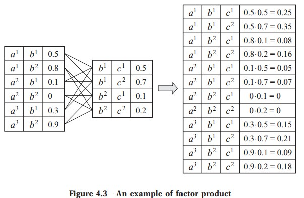

#DataType
We will use structures to implement the factor datatype. The code
  phi = DF([3; 1; 2], [2; 2; 2], rand(8));
creates a factor over variables X_3, X_1, X_2, which are all binary
valued, because phi.card[1] is 2, and likewise for X_1 and X_2. 
phi has been initialized so that phi(X_3, X_1, X_2) = 1 
for any assignment to the variables.

A factor's values are stored in a vector in the .value field 
using an ordering such that the left-most variables as defined in the 
.var field cycle through their values the fastest. More concretely, for 
the factor phi defined above, we have the following mapping from variable 
assignments to the index of the vector in the .value field:

```
+-----+-----+-----+-------------------+
| X_3 | X_1 | X_2 | phi(X_3, X_1, X_2)|
+-----+-----+-----+-------------------+
|  1  |  1  |  1  |    phi.value[1]   |
+-----+-----+-----+-------------------+
|  2  |  1  |  1  |    phi.value[2]   |
+-----+-----+-----+-------------------+
|  1  |  2  |  1  |    phi.value[3]   |
+-----+-----+-----+-------------------+
|  2  |  2  |  1  |    phi.value[4]   |
+-----+-----+-----+-------------------+
|  1  |  1  |  2  |    phi.value[5]   |
+-----+-----+-----+-------------------+
|  2  |  1  |  2  |    phi.value[6]   |
+-----+-----+-----+-------------------+
|  1  |  2  |  2  |    phi.value[7]   |
+-----+-----+-----+-------------------+
|  2  |  2  |  2  |    phi.value[8]   |
+-----+-----+-----+-------------------+
```

# Discrete Factor and its fields.

Factor example in Koller's [PGM book](http://pgm.stanford.edu/), (Fig4.3)



```
julia> X = DF(["B", "A"], [2, 3], rand(6))
DF(["B", "A"],[2, 3],[0.522266, 0.92923, 0.156013, 0.964094, 0.848427, 0.907268])

julia> X.var
2-element ASCIIString Array:
 "B"
 "A"

julia> X.card
2-element Int32 Array:
 2
 3

julia> X.value
6-element Float64 Array:
 0.522266
 0.92923
 0.156013
 0.964094
 0.848427
 0.907268

julia> Y = DFPermute(X, [2, 1])
DF(["A", "B"],[3, 2],[0.522266, 0.156013, 0.848427, 0.92923, 0.964094, 0.907268])
```

# Factor product and factor marginalization

```
julia> A=DF(["a", "b"],[3, 2],[0.5, 0.1, 0.3, 0.8, 0, 0.9]);

julia> B=DF(["b", "c"],[2, 2],[0.5, 0.1, 0.7, 0.2]);

julia> C = A * B  ### C = DFProduct(A, B)
DF(["a", "b", "c"],[3, 2, 2],[0.25, 0.05, 0.15, 0.08, 0.0, 0.09, 0.35, 0.07, 0.21, 0.16, 0.0, 0.18])

julia> DFMarginDrop(C, ["c"])
DF(["a", "b"],[3, 2],[0.6, 0.12, 0.36, 0.24, 0.0, 0.27])

julia> DFMarginKeep(C, ["b", "a"])
DF(["b", "a"],[2, 3],[0.6, 0.24, 0.12, 0.0, 0.36, 0.27])

julia> DFPermute(ans, [2, 1])
DF(["a", "b"],[3, 2],[0.6, 0.12, 0.36, 0.24, 0.0, 0.27])

julia> DFMarginKeep(C, ["a", "b"])
DF(["a", "b"],[3, 2],[0.6, 0.12, 0.36, 0.24, 0.0, 0.27])
```

# Factor reduction and factor normalization

(Continuing above demo)

```
julia> DFReduce(C, ["c"], [1])
DF(["a", "b", "c_{1}"],[3, 2, 1],[0.25, 0.05, 0.15, 0.08, 0.0, 0.09])

julia> DFReduce(C, ["b","c"], [1,1])
DF(["a", "b_{1}", "c_{1}"],[3, 1, 1],[0.25, 0.05, 0.15])

julia> DFNormalize(C)
DF(["a", "b", "c"],[3, 2, 2],[0.157233, 0.0314465, 0.0943396  …  0.132075, 0.100629, 0.0, 0.113208])

julia> sum(ans.value)
0.9999999999999999
```
